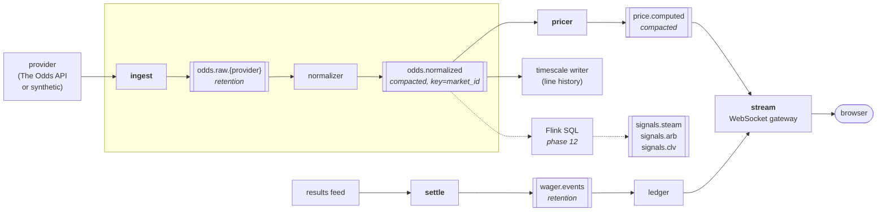

# Sharpline

A real-time sports odds platform — FanDuel-parity feature *surface*, built to run entirely
on self-hosted compute. Odds are ingested from a licensed data provider, normalized,
priced, and streamed live to a browser over WebSocket, with the ingestion, pricing,
storage, and fanout all computed on hardware the author controls.

---

## ⚠️ This is a simulation, not a sportsbook

**Sharpline is a production-shaped, self-hosted sportsbook *simulation*. It is not a
licensed sportsbook and does not attempt to be one.**

| | |
|---|---|
| **Real money** | **No.** No real money moves, ever. Balances are play-money. |
| **KYC / identity verification** | **No.** Not implemented, not stubbed, not planned. |
| **Geolocation gating** | **No.** No state-by-state eligibility checks. |
| **Payment processing** | **No.** No card rails, no ACH, no PCI scope. |
| **Custody of funds** | **No.** Nothing of value is ever held on a user's behalf. |
| **Gaming licence** | **No.** None held, none applied for, none required — because no wagering of value takes place. |

What *is* real is the engineering: real odds from a licensed data provider, a real
double-entry ledger where every stake, payout, void, and adjustment is two rows summing
to zero, real settlement against real results, and real risk accounting.

The distinction is deliberate and it is the point. An unlicensed real-money book is a
legal liability on a résumé; a rigorous simulation of one is an engineering credential.

---

## Quickstart

Install Docker. Then:

```sh
make up
```

That is the entire list. There is no second step, no toolchain to install, no `README`
ritual.

You do **not** need Go, Node, `psql`, `goose`, `golangci-lint`, Terraform, or Python on
your machine. If any command in this repository only works because your host happens to
have one of those installed, that command is **broken** — please open an issue.

Once the stack is healthy, everything is reachable through the reverse proxy on `:80` /
`:443`. Nothing else publishes a host port.

Open **<https://localhost>** — https, not http. Caddy answers `:80` with a `308` to the
https URL, and issues the certificate from its own internal CA, so the browser shows a
warning on first visit until you trust the root at
`/data/caddy/pki/authorities/local/root.crt` inside the `proxy` container. That is expected
on a laptop and is not a misconfiguration: no ACME round-trip means the stack comes up
offline and cannot burn a Let's Encrypt rate limit.

<https://sharpline.localhost> — the default `SHARPLINE_PROXY_HOST` — works too, with no
`/etc/hosts` entry needed, because `.localhost` resolves to loopback. Use the hostname
rather than `https://127.0.0.1`: the bare IP is listed as a site address but the internal
CA issues no certificate for it, so it fails the TLS handshake.

| Path | Goes to |
|---|---|
| `/` | `web` — the Next.js app |
| `/api/*` | `api` — REST + OpenAPI |
| `/ws` | `stream` — WebSocket gateway (upgrade, no session affinity) |

Useful targets:

```sh
make up          # bring up the full stack
make down        # stop it, keeping data
make down-v      # stop it and wipe the named volumes — the reset button
make logs        # tail everything
make test        # run the test suite (in a container, with real dependencies)
make build       # build all six Go binaries (in a container)
make lint        # golangci-lint (in a container)
make help        # the authoritative target list
```

Every one of those is a `docker` invocation. See [The prime directive](#the-prime-directive)
below for why that is not negotiable.

### Configuration

Copy `.env.example` to `.env` and edit. `.env` is git-ignored and must never be committed.

```sh
cp .env.example .env
```

`ODDS_API_KEY` is the interesting one. **Leave it empty and `ingest` starts the synthetic
provider** — a live stochastic market-maker that generates realistic line movement, steam
moves, and book disagreement from a seeded RNG. Set it and `ingest` starts the real
adapter against [The Odds API](https://the-odds-api.com/). Both sit behind the identical
`ProviderAdapter` interface, so nothing downstream can tell the difference.

`SHARPLINE_PROXY_HOST` is the other one worth knowing: it is the single knob that changes
the hostname the stack is served on, read by both `deploy/compose/compose.yaml` and
`deploy/proxy/Caddyfile`. Leave it alone for local work. Point it at a real domain only
once that host is actually reachable on `:80`/`:443`, because Caddy will then attempt real
certificate issuance.

Every other variable in `.env.example` is commented with what reads it and whether compose
overrides it — several are documentation of the config surface rather than live knobs,
because compose sets them explicitly per service.

There is no third mode. In particular there is **no fixture data**: every number you see
in the UI travelled the full path — `provider → ingest → Kafka → normalizer → pricer →
Postgres/Redis → api/stream → browser`. An empty board with a correct empty state is a
correct board. A populated board fed by a hardcoded array would be a defect.

---

## Architecture

A **modular monolith with service-ready seams**: one Go module, six `cmd/` entrypoints.
Every service can run in-process for local development and as its own container in
Kubernetes without code changes — the difference is which binary starts and whether the
event bus is in-memory or Kafka. Premature microservices on a solo project produce
distributed-monolith pain with none of the organizational benefit; the seams are what
make it scalable, and splitting the binaries is a deployment decision made later, cheaply.

### Event flow



Dotted edges are phase 12 and are off by default.

### Services

Six binaries, one parameterized Dockerfile, one Go module.

| Binary | Responsibility |
|---|---|
| `ingest` | Provider adapters, rate limiting, payload normalization, change detection, publish deltas to the bus |
| `pricer` | Devig, no-vig fair value, EV%, Kelly sizing, arbitrage + middles detection, parlay correlation |
| `stream` | WebSocket gateway. Subscription routing, snapshot-then-delta protocol, per-client backpressure |
| `api` | REST + OpenAPI. Auth, catalog, bet slip, wagers, account, history |
| `settle` | Consumes the results feed, grades open wagers, writes ledger entries, emits settlement events |
| `migrate` | Schema migrations (goose). Runs as a compose service locally and a Kubernetes Job in-cluster — never a binary anyone runs by hand |

Every Go service exposes, on its own internal port and its own port only:

| Endpoint | Purpose |
|---|---|
| `GET /healthz` | liveness |
| `GET /readyz` | readiness |
| `GET /metrics` | Prometheus scrape — **not** exposed publicly through the proxy |

`api` additionally mirrors `/healthz` and `/readyz` — and only those two — beneath its
public `/api` prefix, so the stack's health is observable from outside the container
network without publishing a second host port:

```
curl -k https://localhost/api/healthz   # {"status":"ok","service":"api"}
curl -k https://localhost/api/readyz    # {"status":"ready","service":"api"}
```

`/metrics` is deliberately **not** mirrored. The proxy hard-denies `/metrics*` at the site
root, but that matcher does not cover `/api/metrics`; mirroring it would punch a hole
straight through the deny rule.

Because the runtime image is `gcr.io/distroless/static:nonroot` — no shell, no `wget`, no
`curl` — the container healthcheck cannot be a shell command. The service binary probes
itself instead: `sharpline healthcheck` resolves its own listen address, `GET`s `/readyz`
over loopback, and exits 0 or 1. That is what lets compose gate the proxy on
`condition: service_healthy` rather than on "the process was spawned".

### Data plane

| Component | Why |
|---|---|
| **Postgres 17 + TimescaleDB** | Relational core plus hypertables for the odds time-series. Line history (CLV, steam detection, book disagreement) is the interesting dataset and it is inherently time-series. One engine, two access patterns, no second database to operate. |
| **Redis 7** | Current-line snapshot cache, WebSocket presence and subscription state, distributed rate limiting, idempotency keys. **Never the source of truth.** |
| **Apache Kafka (KRaft)** | The event backbone. KRaft removes ZooKeeper, so this is one container rather than a cluster of them. Client is `franz-go` — pure Go, so `CGO_ENABLED=0` and the distroless image survive. See [ADR 0004](docs/adr/0004-kafka-over-nats.md). |

Topics: `odds.raw.{provider}` (retention), `odds.normalized` (compacted, keyed by market),
`price.computed` (compacted), `wager.events` (retention — the settlement audit trail).
Topic configuration is declared in Terraform, not created by hand, precisely because a
`--config cleanup.policy=compact` flag typed once at a CLI is the kind of thing that
silently differs between laptop and cluster.

### Odds math

`internal/domain/odds` is the intellectual core: pure functions over value types, zero
external dependencies, table-driven **and** property-based tests.

- Format conversion — American ↔ decimal ↔ fractional ↔ implied probability
- Overround / vig calculation
- Devigging — multiplicative, additive, power, and Shin. All four, because they disagree
  meaningfully on longshots
- No-vig fair odds and fair probability
- Expected value %, edge, Kelly and fractional-Kelly stake sizing
- Closing Line Value
- Parlay pricing with correlation adjustment for same-game legs

Coverage target is 80% overall and effectively 100% here. Wrong odds math is the one bug
class that destroys this project's credibility.

### Frontend

Next.js 16 App Router, TypeScript strict, Tailwind v4, shadcn/ui, TanStack Query for REST,
Zustand for client state, and a purpose-built WebSocket client. It runs in a container in
both dev and prod; nothing here is ever run with a host `npm`.

The design system is [`DESIGN.md`](DESIGN.md) and it is the source of truth for every
visual decision. Two of its choices look like bugs until you read the argument for them:

- **Price deltas are cyan and amber, never green and red.** Cyan means the implied
  probability fell (the price lengthened), amber means it rose (shortened — steam).
  Blue↔orange is the canonical colourblind-safe axis, and it frees green to mean *money*
  and only money anywhere in the product. Direction is carried redundantly by an arrow
  glyph and by the numeral, so colour is never load-bearing on its own.
- **A 2px decaying rail on each price cell's leading edge, not a cell flash.** Hard onset
  at 0ms, a single-line digit roll at 180ms, then a 2500ms decay. The payoff is a recency
  gradient across the whole board: a glance shows what moved in the last few seconds. A
  300ms full-cell flash across hundreds of cells is a strobe, not information.

**Where the data comes from is split deliberately.** REST is the source for the catalogue
tree — which events exist, which markets hang off them, which selections under those — and
the WebSocket is the source for movement. Board and event pages are React Server
Components that fetch over the in-network service name, so the first paint is real prices
with no spinner and no client waterfall; they hand that page to a client component which
subscribes to the relevant channels and applies deltas in place by
`(market_id, selection_id, book_slug)`. There is no polling anywhere: a REST poll running
beside the socket would render the same change twice and would quietly paper over a dead
stream, which is the one failure the status rail exists to make visible. See
[ADR 0009](docs/adr/0009-frontend-data-plane.md).

Odds format conversion happens client-side from the canonical `decimal_odds`, because the
stream carries only decimal and both feeds must render identically. The TypeScript API
types are generated from `internal/httpapi/openapi.yaml` — the same file the Go server
types and `pkg/client` come from — committed, and drift-checked by `make codegen-check`.

| Route | What it is |
|---|---|
| `/` | Landing poster, and the "simulation, not a licensed sportsbook" disclaimer |
| `/board` | The live odds board across every league |
| `/board/{league}` | The same board scoped to one league — the URL and the WebSocket channel are the same string |
| `/events/{eventId}` | Event detail: full market tree, multi-book comparison, line-movement chart, and the devigged fair value in the mono engineering register |
| `/login`, `/register` | Email + password against argon2id and rotating refresh tokens |

**The engineering layer is permanent, not a debug drawer.** A 24px monospace status rail
sits below the header on every page reporting connection state, connection id, sequence
number, channels held, frame rate, the age of the newest frame, median odds staleness and
the provider that produced the newest quote. Below 768px it collapses to a single pip
whose accessible name states the connection state in words, and tapping it expands the
full rail. Every mono glyph on screen means the machine is talking.

**Accessibility is part of the contract, not a pass at the end.** Every price is a table
cell with an accessible name that states market, selection and price ("Total, Over, 54.5,
minus 108"). Price movement goes to a single `aria-live="polite"` region throttled to one
batched announcement every five seconds ("14 markets moved") — never one per tick, which
would be the worst thing this UI could do to a screen reader user. An individual change is
exposed through `aria-describedby` on focus rather than announced. Under
`prefers-reduced-motion` the digit roll becomes an instant swap and the rail shortens to a
400ms linear fade, but the rail still runs, because it carries information.

Frontend work goes through `make`, and every target is a container:

```bash
make web-ci         # reproducible install from the committed lockfile
make web-typecheck  # tsc --noEmit, strict
make web-lint       # eslint
make web-build      # next build, standalone output
make build-web      # the production image
make codegen-ts     # regenerate the TypeScript API types from the OpenAPI spec
make e2e            # Playwright, one-shot, through the proxy
```

---

---

## The prime directive

**Every process in this system runs in a container.** Backend services, the Next.js
frontend, Postgres, Redis, Kafka, migrations, the observability stack, the reverse proxy,
load tests, browser tests, and the developer tooling itself. There is no "just run this
one thing on the host" exception.

**The host is allowed exactly one dependency: a container runtime.** A contributor with
nothing but Docker installed must be able to clone this repository and reach a fully
running system.

Consequences that are honored rather than worked around:

- `make build` invokes a builder image. It does not shell out to a host `go build`.
- `make test` runs the Go test image with the Docker socket mounted, so `testcontainers-go`
  spawns real Postgres, Redis, and Kafka as sibling containers. No mocked databases and no
  mocked broker — the interesting bugs live in consumer-group rebalancing and offset handling.
- The frontend dev server runs in a container with hot reload intact: source bind-mounted,
  `node_modules` and `.next` on named volumes so host-arch binaries never leak into the image.
- One-off tooling — linting, codegen, OpenAPI generation, `psql` and Kafka CLI shells,
  Terraform, Locust, Playwright — is a `make` target wrapping `docker run`.
- CI uses **no** `actions/setup-go` and **no** `actions/setup-node`. Every job runs
  `make <target>`. The runner is treated as a bare machine with Docker and nothing else.
  This is what mechanically enforces the directive: any step that quietly depends on a
  host toolchain fails in CI even though it passed on a developer's Mac.
- Base images are pinned by `@sha256:` digest, not by floating tag.
- Build contexts are pruned where BuildKit actually reads the rules. Every Go service
  build passes the repository root as its context, so the ignore file that applies is
  `deploy/docker/go.Dockerfile.dockerignore` — the per-Dockerfile sibling, which wins
  outright — with `/.dockerignore` as the conservative fallback for every other
  root-context build. The naming is load-bearing: a file at `deploy/docker/.dockerignore`
  is never consulted for a root context, and one sitting there looks live while doing
  nothing. Pruning cuts the Go context from 712 kB to 8.6 kB, and more importantly stops a
  frontend edit from invalidating the Go build cache.

Rationale: this is the property that makes the "runs on my own server" claim true rather
than aspirational, makes the Kubernetes work a natural extension rather than a bolt-on,
and makes the repository reproducible for anyone who looks at it. See
[ADR 0002](docs/adr/0002-container-mandate.md).

---

## Repository layout

```
sharpline/
├── cmd/                 # api/ ingest/ pricer/ stream/ settle/ migrate/
├── internal/
│   ├── domain/          # types + odds math — zero external deps
│   ├── platform/        # postgres, redis, kafka, otel, config, logging
│   ├── ingest/          # provider adapters, normalizer, scheduler
│   ├── pricing/         # devig, EV, kelly, arbitrage, correlation
│   ├── market/          # market state store, snapshot + delta engine
│   ├── betting/         # slip validation, placement, ledger
│   ├── settlement/      # grading, payout
│   ├── auth/            # tokens, password hashing, 2FA
│   ├── httpapi/         # handlers, middleware, OpenAPI spec
│   └── wsgw/            # websocket hub, subscription routing
├── pkg/client/          # exported Go SDK for the public API
├── web/                 # Next.js app
├── migrations/          # goose SQL migrations
├── deploy/
│   ├── docker/          # one parameterized Go Dockerfile + tooling images
│   ├── compose/         # compose.yaml + dev / obs / tools overlays
│   ├── proxy/           # Caddy — single entrypoint for web + api + ws
│   ├── helm/            # the only Kubernetes deploy path
│   └── terraform/       # cluster, kafka topics, grafana, dns
├── flink/               # Flink SQL job definitions (phase 12)
├── analysis/            # Python: backtesting, quant notebooks
├── test/                # integration (testcontainers)
├── e2e/                 # Playwright
├── load/                # Locust WebSocket fanout tests
├── docs/adr/            # architecture decision records
└── Makefile             # every target is a docker invocation
```

---

## Infrastructure

**Local.** `make up` brings up the data plane, all six Go services, the frontend, and the
proxy. The observability stack sits behind a compose profile. Every long-running container
has a real healthcheck — the stateful ones through their own CLI, the distroless Go
services through the binary's own `healthcheck` self-probe — so `depends_on` gates on
readiness rather than on process spawn. `migrate` runs to completion before `api` starts;
all persistent state is on named volumes so `docker compose down -v` is the reset button.

**The proxy is the only container that publishes a host port.** Everything else talks over
an internal bridge network with service-name DNS. This mirrors the Kubernetes Ingress
topology exactly, so the compose stack and the cluster stack cannot drift into being two
different systems.

**Kubernetes — Helm only.** One chart, `values-dev.yaml` and `values-prod.yaml`. Kustomize
is deliberately not used ([ADR 0005](docs/adr/0005-helm-not-kustomize.md)). Every workload
runs in-cluster, stateful ones included — Postgres, Redis, and Kafka are StatefulSets with
PVCs, not managed cloud services, because the entire point is that this computes on
hardware the author controls. Each Deployment carries resource requests and limits,
liveness/readiness/startup probes, a PodDisruptionBudget, and a default-deny NetworkPolicy
with explicit allows. `stream` must scale horizontally, so there is no session affinity,
which is why subscription state lives in Redis rather than in a pod.

HPA on CPU for `pricer`, and on a custom metric — active WebSocket connections, exported
via the Prometheus adapter — for `stream`.

**Terraform.** Nothing is provisioned by hand: the kind cluster, Kafka topics and their
per-topic retention and compaction settings, Grafana dashboards and alert rules, and
namespaces are all declared. It runs from the `tools` container like everything else.

**Observability.** OpenTelemetry traces span `ingest → pricer → stream`, so a single odds
update can be followed end to end. Prometheus metrics feed a pre-built Grafana dashboard:
odds staleness p50/p99, provider quota remaining, WebSocket connections and dropped
clients, pricing latency, bus lag. Structured JSON logging via `log/slog` with trace
correlation. **Odds staleness is the headline SLO** — it is defined, alerted on, and on
the dashboard.

---

## Testing

Every test tier runs in a container.

| Tier | How |
|---|---|
| Unit | Table-driven. The odds math additionally gets property-based tests (`pgregory.net/rapid`) asserting invariants: probabilities sum to 1 after devig, round-trip conversions are lossless, Kelly is zero at zero edge. |
| Integration | `testcontainers-go` against real Postgres / Redis / Kafka. No mocked databases, no mocked broker. |
| Provider normalization | Golden files against recorded real provider payloads. |
| E2E | Playwright: sign in → browse board → build parlay → place → observe settlement. |
| Load | Locust, distributed master/worker, targeting WebSocket fanout. Stated goal is 10k concurrent subscribers on one node. |

Honest note on Locust: it generates fewer connections per worker than k6 would, because
each user is a Python greenlet rather than a Go goroutine. Compensate with worker count.
The tradeoff was accepted for stack parity and because distributed mode demos better —
driving the `stream` HPA from a Locust worker pool and watching both scale is the single
best demo this project produces.

---

## Roadmap

Each phase ends in a working, demoable system. The tree is never left in a state where
`make up` fails.

| Phase | Deliverable |
|---|---|
| 0 | Container substrate: Dockerfiles, compose stack, Caddy, container-only Makefile, CI that installs no toolchains, ADRs 0001 and 0002 |
| 1 | Domain types and odds math, fully tested. No I/O. |
| 2 | Postgres schema + migrations; Timescale hypertable for prices |
| 3 | Kafka (KRaft) + topic design via Terraform; ingest with synthetic provider; normalizer; change detection; `franz-go` patterns |
| 4 | Pricing engine: devig, fair value, EV, arbitrage |
| 5 | REST API + auth + OpenAPI |
| 6 | WebSocket gateway: snapshot/delta, resync, backpressure |
| 7 | Frontend — design system first, then the live odds board |
| 8 | Bet slip, wagering, double-entry ledger, settlement |
| 9 | Analytics **in Go**: +EV finder, arbitrage scanner, steam detection, CLV tracking |
| 10 | Kubernetes: Helm chart, Terraform, StatefulSets, HPA on WS connections, kind demo |
| 11 | Observability polish, Locust to 10k connections, real provider adapter |
| 12 | Stretch, in order: Flink SQL replacing phase 9 → Kong → Envoy/mesh. Each independently droppable; none blocks a complete demo |

Phase 9 is built in plain Go *before* phase 12's Flink SQL, deliberately. Flink is the
steepest learning curve here and the likeliest thing to become a half-finished distraction
that blocks a working demo. Building Go first means the system is complete regardless, and
the Go implementation becomes the reference the streaming jobs are validated against —
same inputs, same outputs, or the Flink job is wrong.

---

## Stack parity with FanDuel

The project's framing is parity with FanDuel's publicly known stack. Here is where it
matches, where it defers, and where it diverges on purpose.

| FanDuel | Here | Note |
|---|---|---|
| Kubernetes | Yes | Practices, not their 100+ cluster scale |
| React | Yes | via Next.js 16 |
| TypeScript | Yes | Frontend, strict mode |
| Helm | Yes | Sole deploy path |
| Terraform | Yes | Cluster, topics, dashboards |
| Apache Kafka | Yes | KRaft, `franz-go` client |
| Apache Flink | Phase 12 | Flink SQL — no JVM code |
| Locust | Yes | Distributed, drives the HPA demo |
| Python | Yes | Locust + `analysis/` only |
| Kong | Phase 12 | Caddy until then |
| Envoy | Phase 12, optional | Only with a concrete demo |
| **Java** | **No** | Deliberate. See [ADR 0001](docs/adr/0001-go-no-jvm.md) |

### What cannot be parity

Stated plainly rather than glossed:

- **100+ Kubernetes clusters.** This is one cluster, and often one node.
- **Multi-region active-active.** Single region, single site.
- **NFL-Sunday concurrency.** The load target is 10k concurrent WebSocket subscribers on
  one node, which is roughly four orders of magnitude short of a real book's peak.
- **Real money movement.** None. See the top of this file.
- **State-by-state licensing.** None held.
- **KYC.** Not implemented.
- **Geolocation compliance.** Not implemented.
- **PCI scope.** Zero, because no card data exists anywhere in the system.
- **A human trading desk.** There are no traders, no risk managers, and no manual line moves.
- **Proprietary pricing models.** The pricing here is public-literature devigging and
  fair-value math, not a book's actual model.

**Parity here means architecture and tooling, not scale or regulatory surface.** Claiming
more than that is what gets a project like this dismissed by the exact people it is meant
to impress.

---

## Architecture decision records

Decisions that would otherwise be re-argued in six months are written down.

| ADR | Decision |
|---|---|
| [0001](docs/adr/0001-go-no-jvm.md) | Go for all backend services, and explicitly no JVM service |
| [0002](docs/adr/0002-container-mandate.md) | Everything runs in a container; the host's only dependency is a container runtime |
| [0003](docs/adr/0003-odds-provider.md) | The Odds API as the odds provider, with a synthetic fallback — including the quota math |
| [0004](docs/adr/0004-kafka-over-nats.md) | Apache Kafka over NATS JetStream, and `franz-go` over `confluent-kafka-go` |
| [0005](docs/adr/0005-helm-not-kustomize.md) | Helm as the sole Kubernetes deploy path; no Kustomize |

The full project charter — the document every one of these ADRs elaborates on — is
`CLAUDE.md` at the repository root.

---

## Legal

Sharpline accepts no wagers, holds no funds, and processes no payments. It is a technical
demonstration. Nothing in this repository constitutes betting advice, and the analytics
features (EV, Kelly sizing, arbitrage detection, CLV) are implementations of published
mathematics presented for engineering interest, not as a recommendation to gamble.

Odds data is retrieved from a third-party provider under that provider's terms. Users
supplying their own API key are responsible for complying with those terms, including any
restrictions on redistribution or display of the data.
